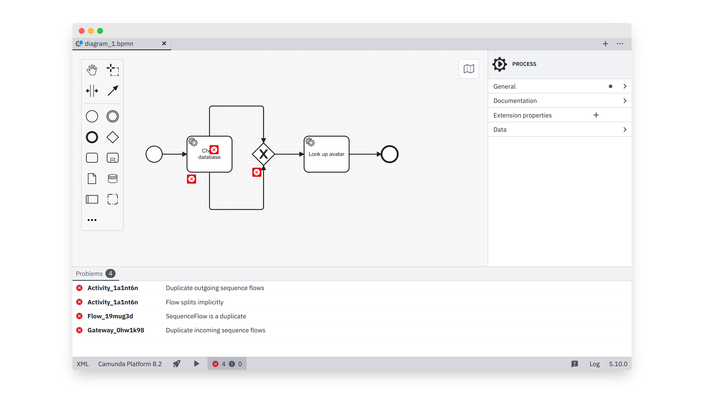

> This plugin adds lint rules to the built-in linting feature introduced in [Camunda Modeler v5.0](https://github.com/camunda/camunda-modeler/blob/develop/CHANGELOG.md#500) and supporting plugins since [v5.4](https://github.com/camunda/camunda-modeler/blob/develop/CHANGELOG.md#540).
>
> To use this plugin with [Camunda Modeler v5.2](https://github.com/camunda/camunda-modeler/blob/develop/CHANGELOG.md#520) and older check out the [`camunda-modeler-5-2` branch](https://github.com/camunda/camunda-modeler-custom-linter-rules-plugin/tree/camunda-modeler-5-2).

# Custom Linter Rules Example Plugin

[](https://github.com/camunda/camunda-modeler)

This plug-in adds the [bpmnlint recommended rules](https://github.com/bpmn-io/bpmnlint) as well as [custom made rules](#creating-rules) to the [Camunda Desktop Modeler](https://github.com/camunda/camunda-modeler). Fork it to suit your needs.




## Configuring Rules

Use the local [`.bpmnlintrc` file](.bpmnlintrc) to configure active lint rules.

Checkout the [bpmnlint documentation](https://github.com/bpmn-io/bpmnlint#configuration) for more information regarding this file.


## Creating Rules

This project ships with a [bpmnlint extension](./bpmnlint-plugin-custom) with the `custom` namespace. Add or edit rules in the [extension's `rules` directory](./bpmnlint-plugin-custom/rules). Activate the rules via the local [`.bpmnlintrc` file](.bpmnlintrc), in order to use them, prefixed with the namespace: 

 ```javascript
{
  "extends": [
     "bpmnlint:recommended",
     "plugin:custom/recommended"
  ],
  "rules": {
    "custom/no-manual-task": "warn",
    "custom/your-other-rule": "error"
  }
}
```


## Plug-in Discovery

The `custom` namespace used by the shipped [bpmnlint extension](./bpmnlint-plugin-custom) is arbitrary, i.e. can be changed freely. However you'd need to take into account how the linting infrastructure discovers rules and configuration:

* It searches the rule provider library in the NodeJS search path (usually `node_modules` folder)
    * For a library `bpmnlint-plugin-{custom}`, given a namespace `{custom}`
    * For a library `{@prefix}/bpmnlint-plugin-{custom}`, given a scoped namespace `{@prefix}/{custom}`
* Within a rule provider library
    * It searches the `rules` folder for a file matching an activated rule name
    * It searches the `config` folder for a file matching a configured configuration or inspect the plug-ins default export

In the case of our custom plug-in `custom/recommended` reference the `custom` configuration, exported by our [plug-ins entry point](/bpmnlint-plugin-custom/index.js). The rule `custom/no-manual-task` on the other hand references [plug-ins entry point](/bpmnlint-plugin-custom/index.js).


## Development

```sh
# initial setup
npm install

# rebuild in development mode
npm run dev

# build the plug-in
npm run all
```

To integrate with the Camunda Desktop Modeler move or link this plug-in into a folder under `resources/plugins` within the Modeler's [plug-in search path](https://docs.camunda.io/docs/components/modeler/desktop-modeler/plugins/#plugging-into-camunda-modeler). Reload the modeler to recognize plug-in changes.

## Before you Publish

* [ ] Clearly state which Camunda Modeler version your plug-in is compatible with
* [ ] Give your plug-in a [unique name](./index.js)


## Additional Resources

* [Camunda Modeler](https://github.com/camunda/camunda-modeler)
* [List of Plug-ins](https://github.com/camunda/camunda-modeler-plugins)
* [Plug-ins documentation](https://docs.camunda.io/docs/components/modeler/desktop-modeler/plugins/#plugging-into-camunda-modeler)
* [bpmnlint](https://github.com/bpmn-io/bpmnlint)


## Licence

MIT
